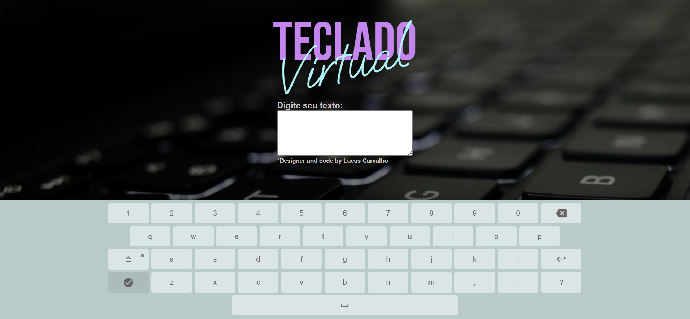

<h1 align="center">Virtual Keyboard</h1>

## Descrição e objetivo do projeto

O objetivo foi criar um teclado virtual, totalmente funcional e responsivo, utilizando JavaScript.

Projeto com uma página simples, onde o teclado virtual é acionado assim que o usuário clica no campo de texto, tendo uma tecla específica para deixar o teclado oculto novamente.

O teclado virtual possui todas as funcionalidades padrão de um teclado, como um identificador "luminoso" ao acionar a tecla Caps Lock, para mostrar ao usuário que a função de letras maiúsculas está ativa.

## :heavy_check_mark: Tecnologias utilizadas

- `HTML`
- `CSS`
- `JavaScript`

## :link: Acesso ao projeto

Você pode acessar o deploy do projeto na Vercel clicando [aqui](https://virtual-keyboard-luccarvalho.vercel.app/).
